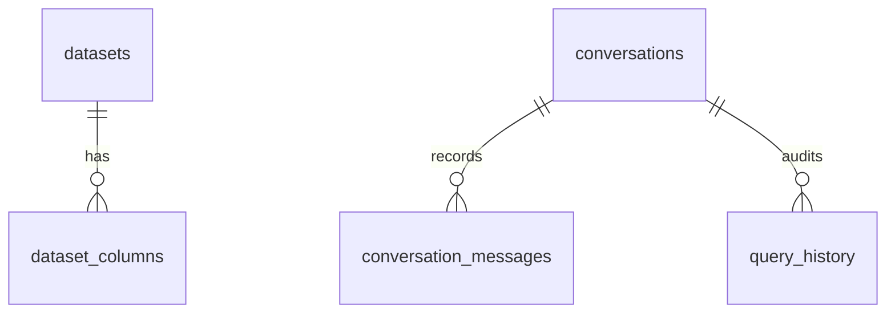

# Database Design & Logging Schema

This document details the PostgreSQL schema, metadata relationships, and audit history query logs.

## 1. Schema Tables

### `datasets`
Represents uploaded catalog datasets:
- `id` (UUID, Primary Key)
- `name` (String, Dataset identifier)
- `original_filename` (String)
- `table_name` (String, Ingested table name in postgres)
- `row_count` (Integer)
- `created_at` (DateTime)

### `dataset_columns`
Represents columns glossary indexed for RAG context:
- `id` (UUID, Primary Key)
- `dataset_id` (ForeignKey to `datasets.id`, cascade delete)
- `column_name` (String)
- `inferred_dtype` (String)
- `sql_type` (String)
- `description` (Text, Business definition mapped to vector RAG index)

### `conversations` & `conversation_messages`
Stores chat history for conversational memory logic:
- `conversation_messages` logs role (`user`/`assistant`), content text, and generated SQL.

### `query_history`
Audit trail of queries processed by the mult-agent pipeline:
- `id` (UUID)
- `conversation_id` (ForeignKey)
- `question` (Original query text)
- `generated_sql` (Executed SQL code)
- `is_valid` (Boolean check)
- `repair_attempts` (Count of self-corrections)
- `row_count` (Result size)
- `error` (Execution error logs, if any)

## 2. Ingested Data Storage
Whenever a CSV is uploaded, a Postgres table with the name `csv_{dataset_id}` or similar is generated. Column names are sanitized (in lowercase with alphanumeric values only), mapped to appropriate SQL data types, populated with copy operations, and constraints are set to prevent write access.
