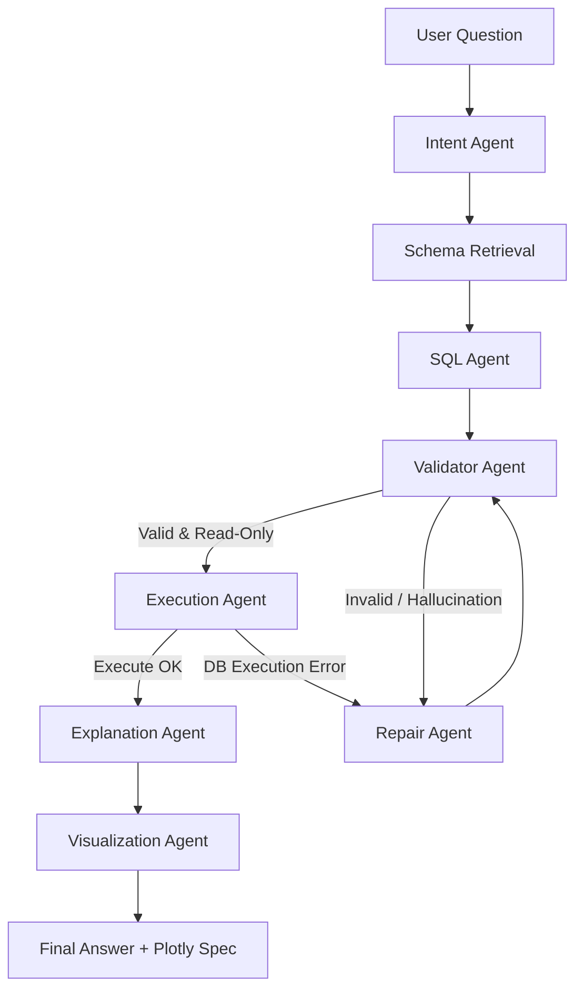

# LangGraph Agent Workflow

This document describes the multi-agent execution pipeline implemented using LangGraph in `backend/agents/workflow.py`.

## 1. Shared State

The pipeline relies on a unified state definition (`AgentState` in `backend/agents/state.py`) passed between agents:
- `question`: Current query string.
- `history`: Conversational memory turns.
- `conversation_id`: Active chat ID.
- `resolved_question`: Self-contained query string after Intent Agent evaluation.
- `sql`: Generated raw SQL query.
- `rows`: SQL execution outputs.
- `explanation`: Natural language summary.
- `chart_spec`: Inferred Plotly configuration.
- `repair_attempts`: Counter to enforce retry caps.
- `validation_errors`: Parser or validation constraints warning flags.

## 2. Nodes in detail

1. **Intent Agent** (`intent_agent.py`): Resolves conversational references (like "Only Electronics" or "now filter top 5") against history.
2. **Schema Retrieval**: Pulls matching database column details from ChromaDB.
3. **SQL Agent** (`sql_agent.py`): Compiles prompts with table/column schemas and retrieves a single SELECT statement.
4. **Validator Agent** (`validator_agent.py`): Utilizes `sqlglot` parser to enforce safety restrictions (no writes/updates) and detect references to hallucinated columns/tables.
5. **Repair Agent** (`repair_agent.py`): Receives SQL compile errors or validation failures, updates instructions, and attempts a self-correction loop (capped by `settings.sql_repair_max_attempts`).
6. **Execution Agent** (`execution_agent.py`): Performs query execution inside PostgreSQL with strict read-only parameters.
7. **Explanation Agent** (`explanation_agent.py`): Interprets rows to formulate a concise response.
8. **Visualization Agent** (`visualization_agent.py`): Detects series shape and outputs the best Plotly specification.
