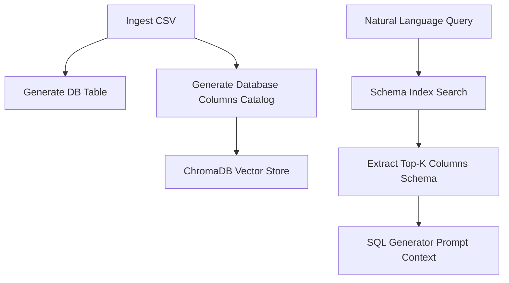

# RAG (Retrieval-Augmented Generation) Pipeline

This document explains the semantic search design and pipeline used by the RAG module in the `AI_SQL_Analyst` platform.

## 1. Concept

When a user asks a question in plain English, the system must translate it into SQL. To write valid SQL, the generator needs to know the database schema: the table name, the column names, and their descriptions. 

Rather than sending the entire database schema to the LLM (which is expensive and increases hallucination risks on large databases), the system uses a **Retrieval-Augmented Generation (RAG)** pipeline to pull only the most relevant columns and tables related to the query.

## 2. Ingestion & Embedding

Whenever a CSV dataset is uploaded:
1. It is mapped to a table in PostgreSQL.
2. The columns are logged in the `dataset_columns` metadata table, along with their data type, inferred SQL type, and a business description.
3. The column metadata (name, type, and glossary description) is compiled into a text document block for indexing.
4. The document block is embedded and stored in a local **ChromaDB** collection (located in `chroma_db/`).

## 3. Retrieval

When an AI query is executing inside the LangGraph workflow:
1. The question is run against ChromaDB to search for the **top-k** most semantically relevant column descriptors.
2. The search returns metadata strings containing column names, types, and glossary context (e.g. `revenue: float - Final price after discount`).
3. These retrieved columns are formatted as part of the system prompt context sent to the `sql_agent`, giving the LLM precise schema coordinates.
