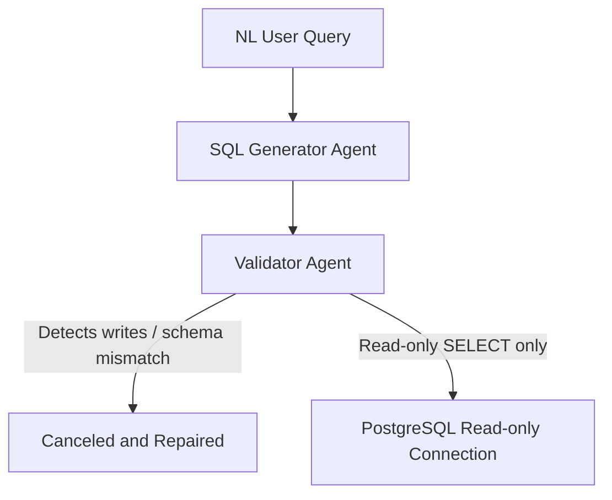

# Security & SQL Safety Model

This document outlines the safety measures implemented in `AI_SQL_Analyst` to prevent SQL injections, write access, and unauthorized executions.

## 1. Static AST Parsing (sqlglot)

The platform enforces strict rules before executing any generated SQL against the database using `sqlglot` to parse the Abstract Syntax Tree (AST):
- **Read-Only Verification**: The query must compile to a single, isolated `SELECT` AST node. Any presence of `INSERT`, `UPDATE`, `DELETE`, `DROP`, `ALTER`, `CREATE`, `REPLACE`, or system calls immediately triggers a validation block.
- **Hallucination Detection**: The AST parser inspects all projected columns and referenced tables to cross-reference them with the active dataset's actual Postgres metadata schema. If a query tries to fetch a non-existent column or table, the validator blocks execution and forwards context back to the `repair_agent` to fix the hallucination.

## 2. PostgreSQL Connection Safety

To complement the static validation layer:
- The database user credentials (e.g. `sql_analyst`) should be configured with read-only permissions (`GRANT SELECT ON ALL TABLES IN SCHEMA public TO...`) on production environments.
- Query executions are capped in rows (limit 100) and execution time is bounded to prevent denial-of-service (DoS) from runaway queries.
